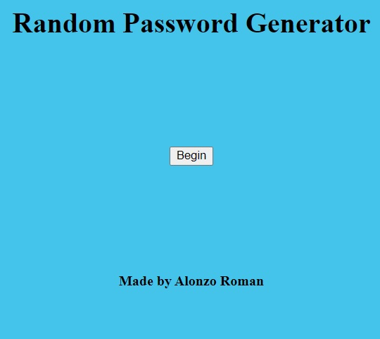
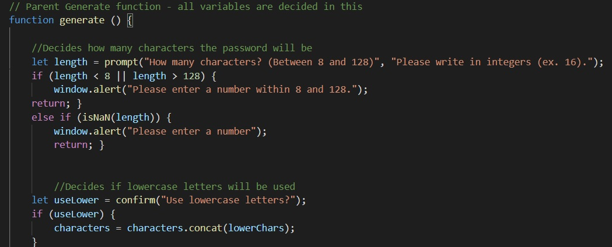

# code-password

## Author
Alonzo Roman

## Summary
The goal of this project was to create a random password generator. The parameters were to be set by the user, such as character length, and the use of upper or lower case letters, numbers, and special characters. Once all the parameters are set, the generated password is then displayed and able to be copied by the user. 

## Screenshot

## Code Snippet

## Steps
- Created the repository and readme file

- Cloned the repository and added index, css and js files

- Wrote html to include header, footer, and a button to trigger the password generator function

- Established variables within javascript for the user to opt in/out of (Uppercase and lowercase letters, numbers, and special characters)

- Wrote a function to ask the user for preferences, including a character count

- Ensured the function accepted every parameter individually

- Linked the button in html in order to begin the password generator function 

- Styled the page in CSS 

- Finalized Readme

## Deployed Link
- [https://alonzofroman.github.io/omg-so-random-password/](#)

## Technologies Used
- [HTML] (https://developer.mozilla.org/en-US/docs/Web/HTML)
- [CSS] (https://developer.mozilla.org/en-US/docs/Web/CSS)
- [Javascript] (https://developer.mozilla.org/en-US/docs/Web/JavaScript)

## Contact Links

- Github (https://github.com/alonzofroman)
- LinkedIn (https://www.linkedin.com/in/alonzo-roman/")

## Resources/Acknowledgements 

- W3Schools (https://www.w3schools.com/)
- MDN Web Docs (https://developer.mozilla.org/en-US/)

